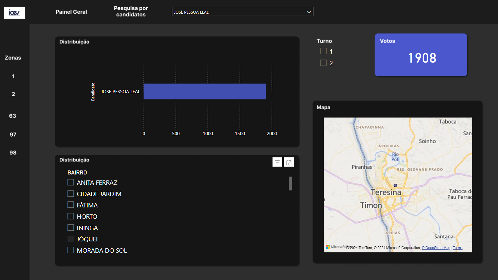

## Introdução
Dashboard em Power BI que mostra dados concisos das eleições para prefeito de Teresina - PI
no ano de 2020 (dados extraídos do TRE piauí). A priori, foi feita uma limpeza e análise
exploratória dos dados. Para assim, ser organizada com o design simples e direto que mostra
as principais informações, sendo elas distribuições de votos por candidato, turno, bairro e
zona

link: https://app.powerbi.com/view?r=eyJrIjoiYzhjMTA3MGEtMTdjMC00YWNhLTk5OTMtZTFjYWQyY2MyMDk3IiwidCI6ImJlODMxODVmLWYwZGEtNDUxNS05ZjAxLWUyYTE4NTgyYmI4YSJ9

## Página principal

## Filtro na página principal por candidato

## Filtro na página principal primeiro turno 

## Filtro por bairro

## Filtro por zona 98

